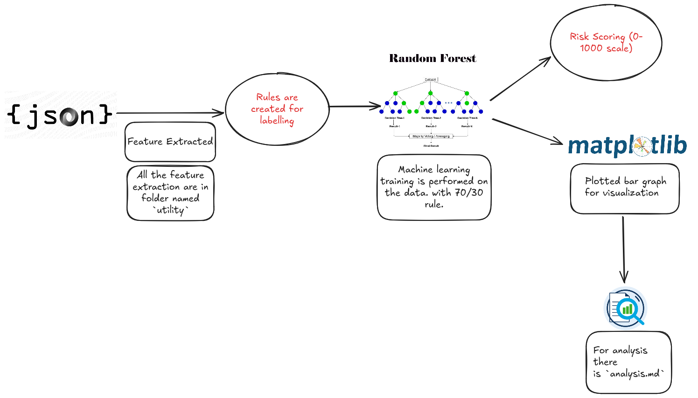

# Model For AAVE-2 Protocol

### What is this project about ?

This project is about creating a Machine Learning Model by analysing the DeFI wallets behavior that assigns a credit-score to a wallet between 0 to 1000, the trasaction details is in the json file `user-wallet-trasactions.json`.

### Steps & Processsing flow

1. The first step is to get the total number of wallets from the json file using sets in python. There are about 100,000 trasaction details in the `user-wallet-transactions.json`. For calculating this we have a separate file `totalwallets.py`.

    - There are about 3497 total unique wallets in the json file.

2. The second step is to get the action performed by each wallet for this dedicated step we created a file called `actions.py`. There are total of 5 actions that is converted to features : `deposit`, `borrow`, `liquidationcall`, `repay` & `redeemunderlying`. 

**Note** : There is also a 2(b) step we used which is to calculate `total_liquidated_collateral_usd` & `total_liquidated_principal_usd` we used them in code as a `liquidation_count`

3. The third step is to convert this `wallet_stats` in `action.py` into a pandas dataframe.

4. The fourth step is about calculating the timestamp between each action performed by a wallet , this means that for every transaction there is a time gap, we calculated the features these are : 
    - The total number of transaction per wallet
    - The average time gap in seconds
    - Minimum time gap in seconds 
    - Time span in days 
    - The burst activity
    - The burst count. 
    
    This is contained in file `timestamp.py`

5. The fifth step is about calculating the assetprice of each wallet addresss contained in the file `assetprice.py`. There are about 5 features more we calculated, they all definitely were not used but we used `total_repay_usd` & `total_borrow_usd` for repay_ratio

6. The sixth step is to create a dataframe out of all the features extracted from timestamp, assetprice and action, there are about 17 columns which are created using these data collection and feature engineering techinques. After merging this a feature rich dataframe is formed which is `df_all` inside `main.py`.

7. The seventh step is to create a label for Machine learning model, which is created using the Rule based risk labeling, to classify wallets as `risky` and `safe` which is `is_risky` column, based on DeFi-native behavior.

    Indicators that indicate wallet is risky :
    
    - If wallet has action : `liquidationcall`.
    - If **borrowed** and not **repayed**.
    - If repay ratio is **<0.4**.
    - Burst activity is **>20** (means suspicious transaction patterns).
    - Avg transaction time **<60** sec with high transaction count.
    - Aggressive behavior : borrow + redeem + rapid transactions.
    
    Indicators that indicate wallet is safe :
    
    - If wallets never borrowed.
    - Wallets that borrowed but also repayed & no liquidation.

    By all the above logic is created the `is_risky` column, which became our ground truth for training Machine.

8. The eighth step was model training and testing, for this we used `Random Forest Classifier`, in this we split the data into 70 training and 30 testing rule. The evaluation result is :

        Accuracy:       97%
        Precision (risky): 99%
        Recall (risky):    91%
        F1-score:       ~96%
    You can get this result by running command in root directory `python main.py`.

9. The ninth step was to calculate the Risk Score (0-1000 scale), by using model prediction probabilities every wallet get a risk score of 0 to 1000.  You can check the model score distribution in `analysis.md`.

10. The tenth step was to analyse the Score distribution, which is plotted using mat-plotlib library, you can check the `score-distribution.png`. 

## Architecture 

### 1. Data Ingestion Layer

**Modules Involved:**
- `utility.actions.ActionatEachWallet()`
- `utility.timestamp.timestampfeatures()`
- `utility.assetprice.assetfeatures()`

**Description:**
- Extracts wallet-wise behavior from blockchain logs (on-chain actions).
- Converts raw transaction history into structured per-wallet features.

**Data Features Generated:**
- `deposit_count`, `borrow_count`, `repay_count`, `redeem_count`
- `total_borrow_usd`, `total_repay_usd`, `total_liquidated_collateral_usd`
- `avg_time_gap`, `burst_count`, `total_transactions`, etc.

### 2. Rule-Based Labeling Engine

**Description**

- Uses handcrafted rules to determine if a wallet is risky (1) or safe (0).

- Rules based on behavioral logic:

    - Liquidation events

    - Repay ratio

    - Suspiciously fast bursts

    - Borrow without repayment

    - Aggressive borrow + redeem activity

**Outcome**

Assigns `is_risky` column to each wallet as ground truth for ML.

### 3. Machine Learning Pipeline

#### Steps

**Data Split:**

    train_test_split(X, y, test_size=0.3) → 70/30

**Model:**

    RandomForestClassifier()

**Training:**

Model trained on the manually labeled data.

**Evaluation:**

Uses classification_report() to evaluate

- Accuracy: ~97%

- Precision/Recall: for risky and safe wallets

**Goal:**

Learn hidden patterns that may not be captured by rules.

### 4. Wallet Scoring Engine (0–1000)

#### Process

**Predict probabilities using:**

    model.predict_proba(X_test)[:, index_of_safe]

**Convert to scores:**

    ML_score_0_1000 = (probability_of_safe * 1000)

**Output:**

Each wallet gets a score between 0 (high risk) and 1000 (very safe).

### 5. Analysis & Visualization Layer

**Outputs:**

- `scored_wallets.csv`: Final scores + true labels

- `score_distribution.png`: Binned histogram (0-100, 100-200, …)

**Insights Extracted:**

- Distribution of safe vs risky

- Behavior in lower vs higher buckets

- Model confidence behavior

### 6. Documentation & Summary Generation

To be generated in `analysis.md`:

- Score distribution table

- Behavioral analysis of high vs low score wallets

- Visual summary of risk landscape

