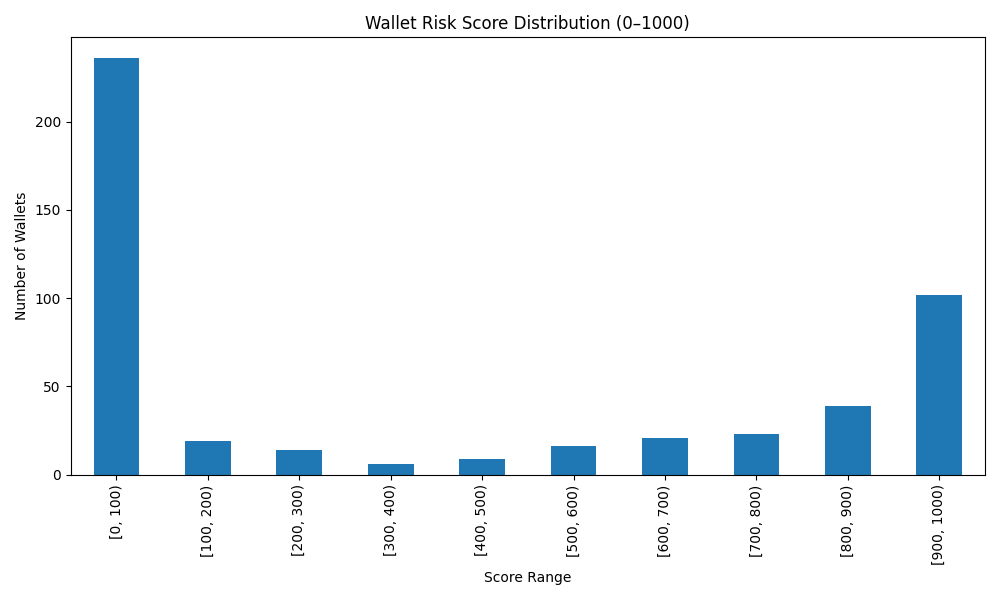

# Wallet Risk Score Analysis (Aave v2)

This report presents an analysis of wallet behavior based on their **ML-derived risk scores (0–1000)**. These scores are generated using a Random Forest model trained on features like action counts, time-based activity, and transaction value data.

---

## Score Distribution

Below is the distribution of wallet scores, grouped into 100-point bins:

| Score Range   | Wallet Count |
|---------------|--------------|
| 0–100         | 236          |
| 100–200       | 19           |
| 200–300       | 14           |
| 300–400       | 6            |
| 400–500       | 9            |
| 500–600       | 16           |
| 600–700       | 21           |
| 700–800       | 23           |
| 800–900       | 39           |
| 900–1000      | 102          |

>  A majority of wallets fall into two distinct clusters: **very high scores (safe)** and **very low scores (risky)** — indicating that wallet behavior is polarized.

---

##  Behavior of Wallets with Low Scores (0–300)

Wallets with low scores (especially 0–100) tend to:

- Have **very high burst activity** (lots of txns in short periods)
- Show **no repayments** after borrowing
- Participate in **liquidation events**
- Perform **rapid borrow–redeem loops**
- Often **borrow more than they repay** (low repay/borrow ratio)
- Short average time gap between actions (high bot-like behavior)

> 🔎 These wallets are likely automated or risky actors possibly exploiting Aave liquidity or yield farming aggressively.

---

##  Behavior of Wallets with High Scores (700–1000)

These wallets show healthy, low-risk behavior:

- Mostly **depositors only** or **well-behaved borrowers**
- Regular **repayment activity**
- **No liquidation events**
- Spread-out transactions — no suspicious bursts
- Reasonable time between actions
- Often **long-term holders** or passive users

> These users are consistent with expected protocol use and present low risk of bad debt or abuse.

---

##  Conclusion

The ML risk score model provides a useful early-warning system for wallet monitoring. Score-based clustering reveals two primary wallet classes:

- **Safe Users** → Can be incentivized or rewarded
- **Risky Users** → Should be monitored or capped

Further improvements can include:

- Time-series based modeling (LSTM/RNN)
- Cross-protocol behavior analysis
- On-chain reputation integration

---

